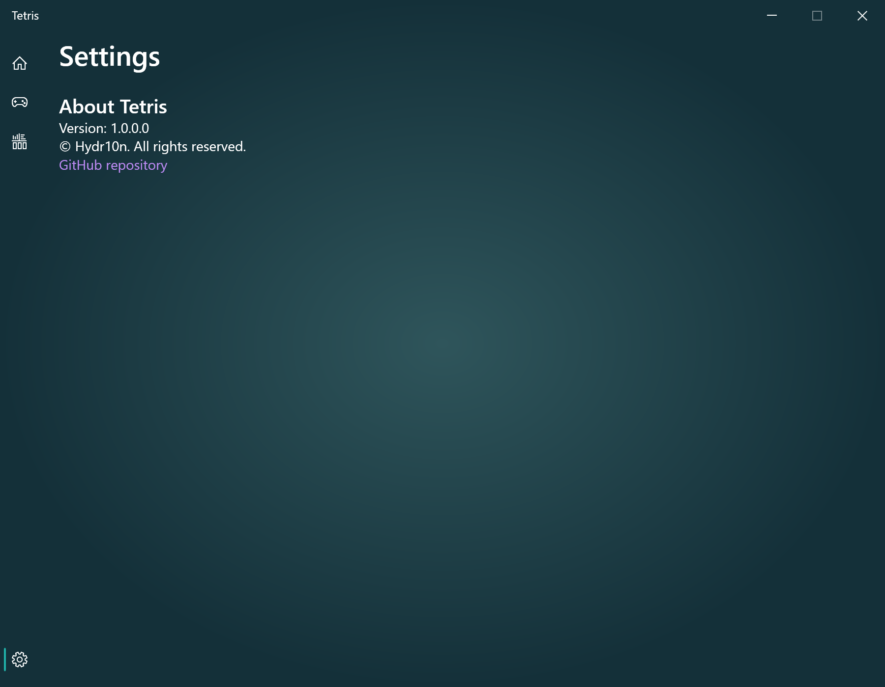

# Tetris

This is a remastered version of the classic Tetris game, with additional Microsoft Xbox Controller input support.

## Minimum Build Requirements
* Microsoft Visual Studio 2019 IDE with .NET desktop development workload installed
* Microsoft .NET Framework 4.8 SDK

